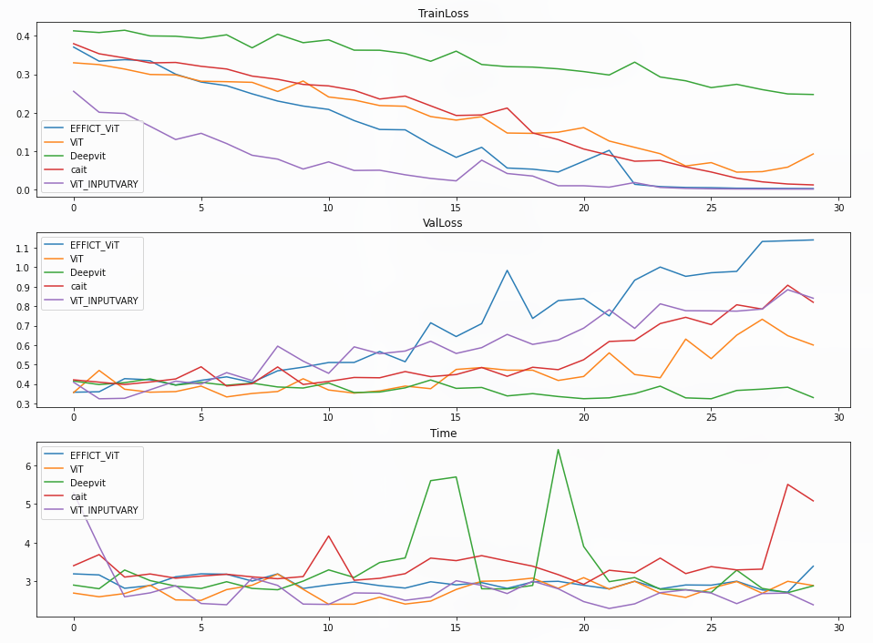

# Vision Transformer Improvements

## Directory Structure
```
.
├── img
├── 3020202184-刘锦帆-深度学习大作业.pdf  -- Report (PDF)
├── paper                                 -- Report (LaTeX)
├── README.md
└── vit.ipynb                             -- Code
4 directories, 28 files
```

## Getting Started

### Environment

1. OS: As long as Python is portable
2. Conda: 22.11.1
3. Python Environment:
* Python: >= 3.7
```shell
conda create -y --name=vit
conda activate vit
conda install pip
pip install datasets vit-pytorch torch Linformer torchvision matplotlib torch numpy jupyter-lab
```

### Downlaod Dataset

* Via [datasets](https://pypi.org/project/datasets/)
* Total datasets could be as large as 5GB or more, please make sure you have enough space for it.
* This could be done in the next step inside the Jupyter Notebook
```python
food = load_dataset("food101", split="train[:1000]")
```
> Note: The data will be cached in `~/.cache/huggingface` on Unix-like Systems to save for next time usage

### Running the code

1. type in `jupyter-lab .` in the directory
2. click run button

### Results

<center>
    <br>
    <div style="color:orange; border-bottom: 1px solid #d9d9d9;display: inline-block;color: #999;padding: 2px;">Training Results</div>
</center>
